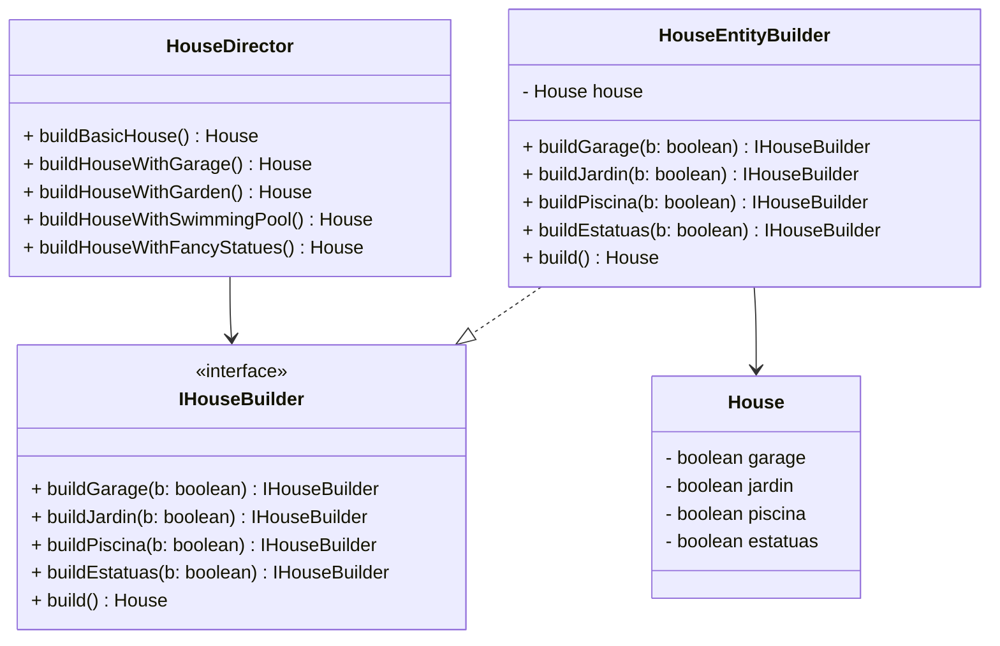

# java-design_patterns-house_builder

An exercise done with Java to put into practice the builder pattern we are studying.

## Class diagram

```mermaid
classDiagram
    class House {
        - boolean garage
        - boolean jardin
        - boolean piscina
        - boolean estatuas
    }

    class IHouseBuilder {
        <<interface>>
        + buildGarage(b: boolean) IHouseBuilder
        + buildJardin(b: boolean) IHouseBuilder
        + buildPiscina(b: boolean) IHouseBuilder
        + buildEstatuas(b: boolean) IHouseBuilder
        + build() House
    }

    class HouseEntityBuilder {
        - House house
        + buildGarage(b: boolean) IHouseBuilder
        + buildJardin(b: boolean) IHouseBuilder
        + buildPiscina(b: boolean) IHouseBuilder
        + buildEstatuas(b: boolean) IHouseBuilder
        + build() House
    }

    class HouseDirector {
        + buildBasicHouse() House
        + buildHouseWithGarage() House
        + buildHouseWithGarden() House
        + buildHouseWithSwimmingPool() House
        + buildHouseWithFancyStatues() House
    }

    HouseDirector --> IHouseBuilder
    HouseEntityBuilder ..|> IHouseBuilder
    HouseEntityBuilder --> House
``` 

## Test coverage

